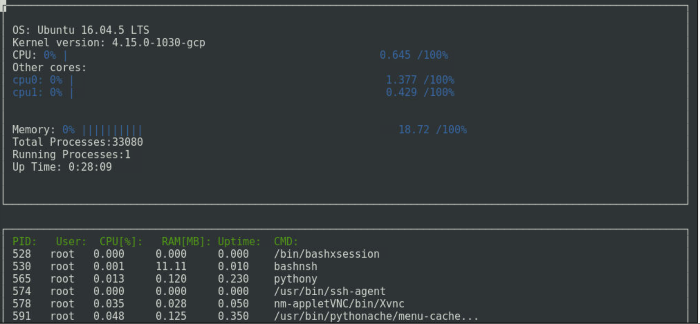

# C++ Linux-System-Monitor

Linux System Monitor Project for C++ OOP. Starter code on which this repository is based is available [in this repository](https://github.com/udacity/CppND-System-Monitor/) 

#### Sample setup and compile instructions:

* Clone repository into your `home` directory

```
git clone https://github.com/viks8dm/Cpp-Linux-System-Monitor.git
```

* Install `ncurses` package

```
sudo apt-get install libncurses5-dev libncursesw5-dev
```

* Compile and run

```
g++ -std="c++17" main.cpp -lncurses
./a.out
```

#### Result
On a seccessful run, output should look similar to that in image below:


